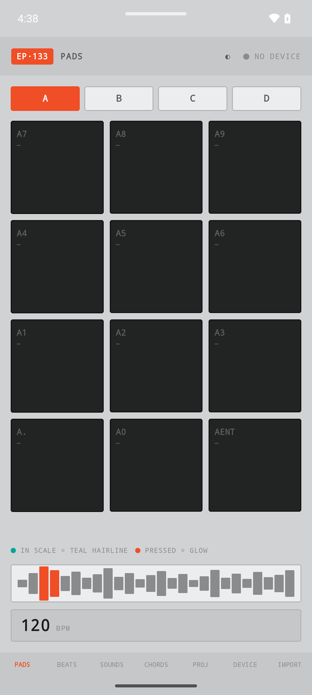
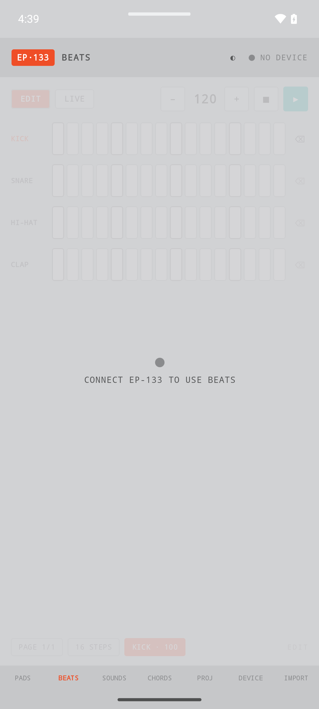
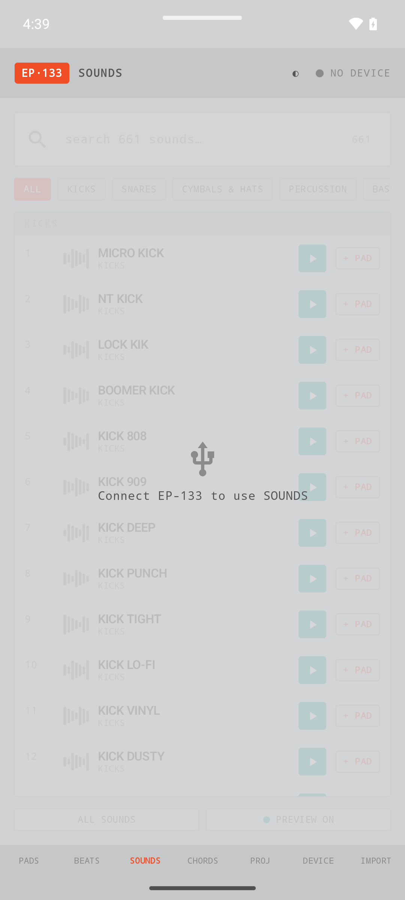
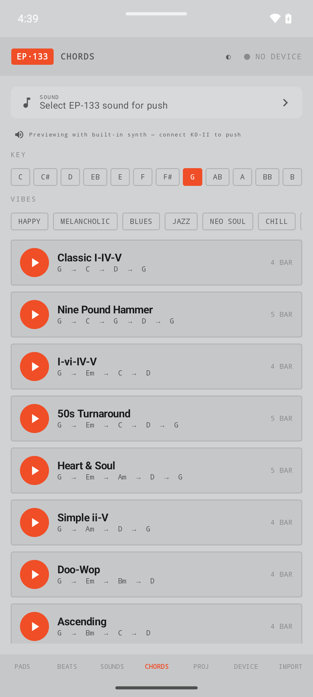
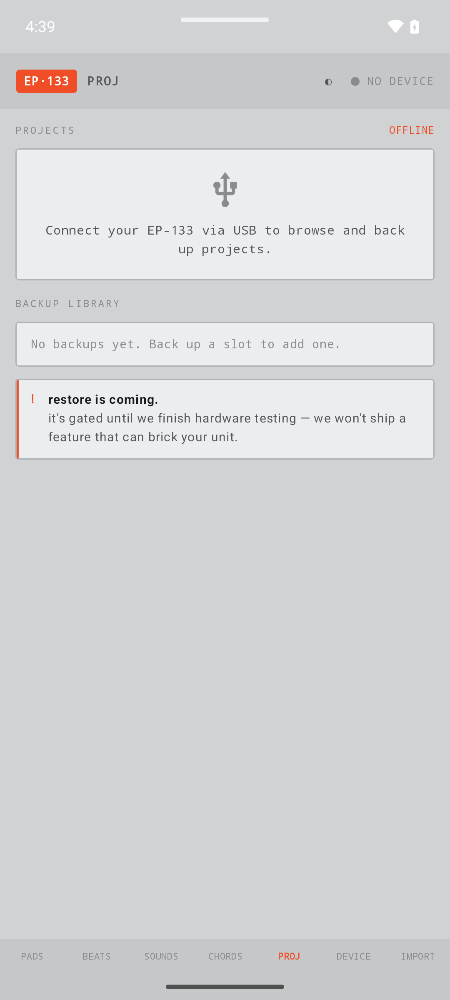
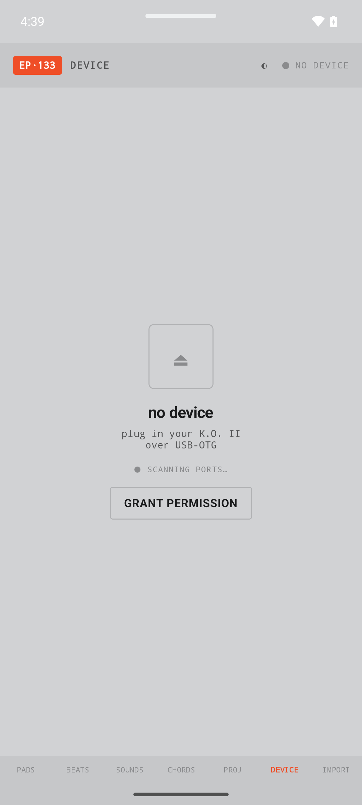
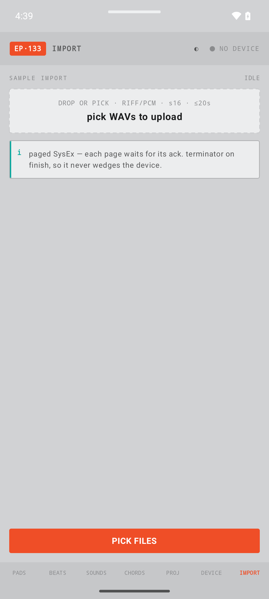
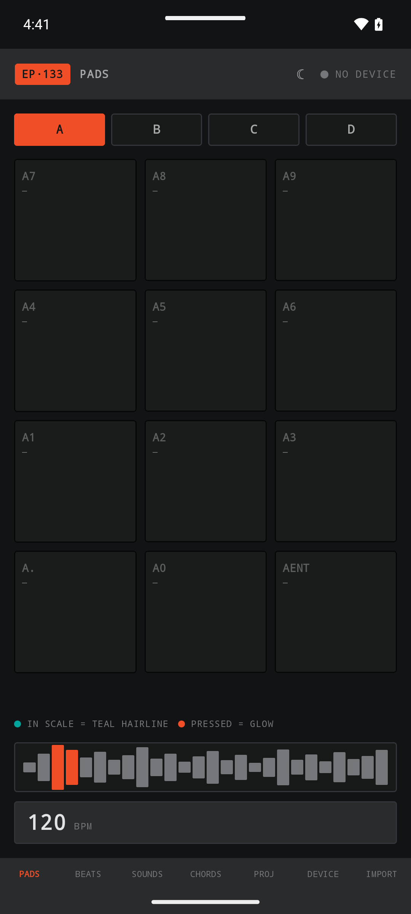
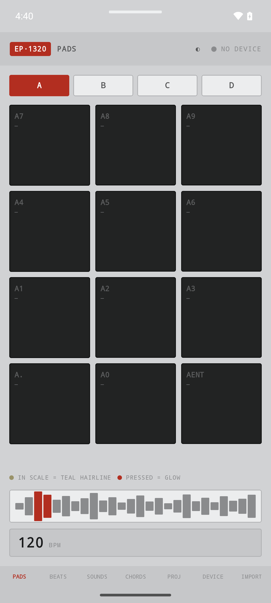

# EP-133 Sample Tool — Android user manual

This one's for the community. A free, offline app to load your own samples onto the
EP-133 / EP-1320 K.O. II straight from your phone, plus play your kit, sketch beats,
audition sounds, and build chord progressions. From [Bombest Audio](https://bom.best),
with love.

No cloud. No account. No telemetry. You plug your K.O. II into your phone over USB and
everything happens right there on the device. We reverse-engineered the whole file
protocol to make it work, and we wrote it all down — see the
[SysEx protocol notes](#the-protocol) at the bottom.

> Heads up on the screenshots: I shot these on an emulator with no hardware attached, so
> you'll see "NO DEVICE" up top and "connect EP-133" prompts on a few screens. That's the
> offline state, working as intended. Plug in a real K.O. II and those screens light up.

---

## Getting it running

You need an Android phone or tablet on **Android 10 or newer** — that's the floor for USB
MIDI to work. A tablet's nice for the bigger pads, but a phone is fine.

1. Install the app (grab the APK from releases, or build it yourself — see the
   [repo README](../../README.md)).
2. Grab a **USB-OTG** cable or adapter. The K.O. II talks over USB; your phone needs to be
   the host. Most USB-C phones from the last few years do this out the box.
3. Plug the K.O. II into your phone and power it on.
4. Open the app, hit the **DEVICE** tab, and tap **GRANT PERMISSION** when Android asks.
   That's Android's USB permission prompt — you have to say yes once per connection.

That's it. Once it connects, the "NO DEVICE" up top flips to your unit and the connected
features wake up.

---

## The tour

Seven tabs across the bottom: **PADS · BEATS · SOUNDS · CHORDS · PROJ · DEVICE · IMPORT**.
Here's what each one does.

### Pads — play your kit

This is your kit, laid out like the hardware. A/B/C/D up top switch between the four pad
groups, twelve pads each. Tap a pad, it fires the sound on the device.

Two things to know about the colors. A **teal hairline** around a pad means it's in the
current scale — handy when you're playing melodic. A pad that **glows** is one you're
pressing. The legend's right there under the grid so you don't have to remember.

BPM sits at the bottom with the waveform strip above it.

### Beats — the 16-step sequencer

Four lanes — KICK, SNARE, HI-HAT, CLAP — sixteen steps each. Tap steps to build a pattern.
**EDIT** lets you program; **LIVE** lets you jam over it. Transport and BPM are up top,
page and step controls down at the bottom.

This one needs the K.O. II plugged in, so offline you'll see "connect EP-133 to use beats."

### Sounds — browse, preview, assign

The whole sound library, searchable. 661 sounds in the factory pack, filtered by category —
KICKS, SNARES, CYMBALS & HATS, PERCUSSION, BASS, on down the list. Search by name up top.

Hit the **play** button to preview a sound, hit **+ PAD** to drop it onto a pad. Preview
toggles on and off with the switch at the bottom.

### Chords — progressions, your key, your vibe

This is the one I'm proudest of. Pick a **key** (C through B), pick a **vibe** — HAPPY,
MELANCHOLIC, BLUES, JAZZ, NEO SOUL, CHILL — and it serves you progressions that fit. Classic
I-IV-V, 50s Turnaround, Doo-Wop, ii-V, all of it, transposed into your key with the bar count
right there.

Tap play to hear one. It previews through a **built-in synth** so you can audition without
hardware, and when your K.O. II is plugged in you pick a sound up top and push the
progression to the device.

### Projects — your backups

Browse and back up the projects on your connected unit. Backups land in your **backup
library** so you've got copies that aren't living only on the device.

One straight-up note you'll see on this screen: **restore is gated for now.** It's coming,
but it stays off until hardware testing is done. I'm not shipping a feature that can brick
your unit. Backup works today; restore lands when I trust it.

### Device — connection and storage

Your connection home base. When nothing's plugged in it says "no device — plug in your
K.O. II over USB-OTG" and scans for ports, with the **GRANT PERMISSION** button for Android's
USB prompt. Plug in and this fills out with connection status, storage, and the
backup/restore/format controls.

### Sample Import — the headline

This is the reason the whole thing exists. **Load your own WAVs onto the K.O. II.**

Pick files (or drop them in): mono or stereo RIFF/PCM, 16-bit, up to 20 seconds each. Hit
**PICK FILES**, and the app uploads them to the device over **paged SysEx** — each page waits
for its acknowledgement before the next goes out, with a clean terminator on finish. That's
the careful path: it never floods the device and never wedges it mid-transfer. Figuring this
out is most of what's in the [protocol notes](#the-protocol).

Needs a connected unit to actually push, naturally.

---

## Themes

Two toggles live in the header.

The **glyph** left of the connection dot cycles your look: **system → light → dark.** Same
app, whichever way your eyes want it.

The **badge** top-left flips the SKU skin. Tap **EP·133** and it becomes **EP·1320** — orange
swaps for the rust red, to match whichever box you own.

---

## What needs hardware

Quick map, so you know what to expect before you plug in:

| Works offline | Needs the K.O. II over USB |
|---|---|
| Browse Sounds, search the library | Firing pads on the device |
| Audition Chords (built-in synth) | Recording / playing Beats |
| Pick your key and vibe | Pushing chord progressions |
| Switch theme and SKU | **Importing your own samples** |
| | Browsing and backing up Projects |

The screenshots here are all offline states. Real hardware turns "NO DEVICE" into your unit
and everything connected comes alive.

---

## The protocol

There's no official spec for how the K.O. II moves files over USB-MIDI. So we sniffed it,
verified it on real hardware, and wrote the whole thing down — frame format, the file-session
handshake, directory listing, sample upload, and every gotcha that cost us a night.

- [**SysEx protocol reference**](../ep133-sysex-protocol.md) — the full markdown notes
- [**Web version**](https://bombest-audio.github.io/ep_133_sample_tool/protocol.html) — same
  thing, prettier, on the site

If you're building anything for the K.O. II, start there. It's MIT — take it.

---

Found a bug, want a feature, got protocol corrections? PRs welcome — see
[CONTRIBUTING.md](../../CONTRIBUTING.md). Be cool to each other.

Peace,
Thomas — Bombest Audio
